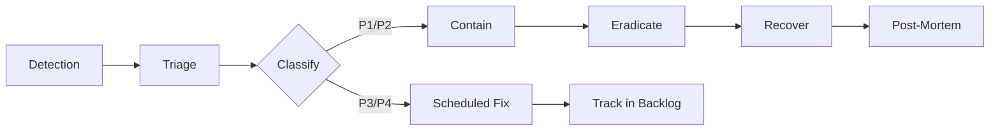
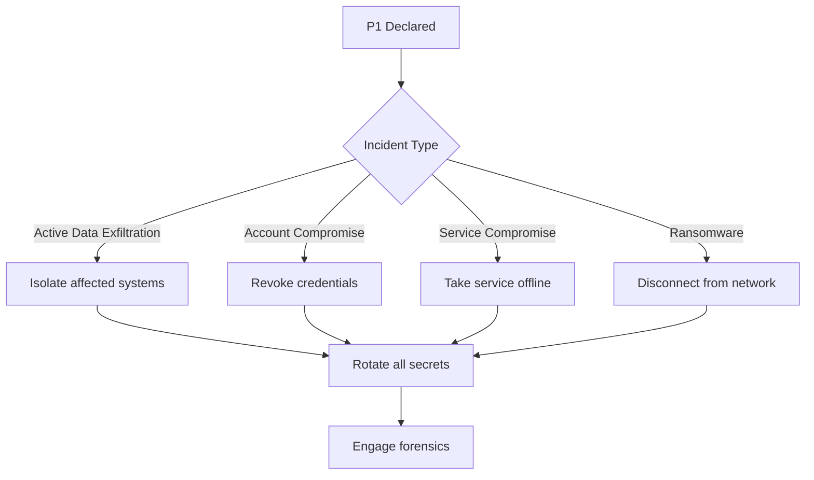

# Security Incident Response Runbook

> **Platform:** Telecom OSS/BSS Platform
> **Last Updated:** 2026-06-21
> **Owner:** Security Team
> **Classification:** Internal — Confidential

---

## Table of Contents

1. [Incident Classification](#1-incident-classification)
2. [Response Team Structure](#2-response-team-structure)
3. [Response Lifecycle](#3-response-lifecycle)
4. [Containment Procedures](#4-containment-procedures)
5. [Data Breach Notification Flow](#5-data-breach-notification-flow)
6. [Post-Mortem Process](#6-post-mortem-process)
7. [Communication Templates](#7-communication-templates)
8. [Appendix](#8-appendix)

---

## 1. Incident Classification

### Severity Levels

| Level | Description | Response Time | Examples |
|-------|-------------|---------------|----------|
| **P1 — Critical** | Active data breach or service compromise affecting production data or availability | Immediate (< 15 min) | Unauthorized database access, ransomware, active account takeover at scale |
| **P2 — High** | Confirmed vulnerability or unauthorized access with limited blast radius | < 1 hour | Stolen developer credential used, SSRF exploited against internal service, cross-tenant data access confirmed |
| **P3 — Medium** | Suspected vulnerability or policy violation, no evidence of data access | < 4 hours | Suspicious API patterns, failed intrusion attempts, policy violation (secret in code) |
| **P4 — Low** | Best practice gap, no immediate risk | < 1 week | Missing security header, outdated dependency without known exploit, documentation gap |

### Classification Decision Matrix

```
Is customer data confirmed accessed?
  ├── Yes → P1
  └── No  → Is there active exploitation?
              ├── Yes → P1
              └── No  → Is a vulnerability confirmed?
                          ├── Yes → P2
                          └── No  → Can it be reproduced?
                                      ├── Yes → P3
                                      └── No  → P4
```

---

## 2. Response Team Structure

### Core Response Team (IC: Incident Command)

| Role | Responsibility | Primary | Secondary |
|------|---------------|---------|-----------|
| **Incident Commander (IC)** | Overall coordination, communication, decision-making | Security Lead | Engineering Lead |
| **Scribe** | Timeline logging, evidence preservation | On-call Engineer | N/A |
| **Technical Lead** | Containment, analysis, remediation | Senior Engineer | Platform Lead |
| **Communications Lead** | Internal/external messaging, stakeholder updates | Product Manager | Engineering Manager |
| **Legal/Compliance** | Regulatory notification, legal holds | Legal Counsel | CISO |

### On-Call Rotation

- **Primary:** Security engineer (24/7, weekly rotation)
- **Secondary:** Platform engineer (24/7, weekly rotation)
- **Escalation:** Security Lead → CISO

### Contact Channels

| Channel | Purpose | P1 | P2+ |
|---------|---------|----|-----|
| **#security-alerts** (Slack/PagerDuty) | Automated alerts | ✓ | ✓ |
| **Incident bridge call** | Real-time coordination | ✓ | On request |
| **Security mailing list** | Post-incident communication | ✓ | ✓ |
| **Customer support ticket** | Customer-facing updates | ✓ | ✓ |

---

## 3. Response Lifecycle



### Phase 1: Detection (0-15 min)

**Triggers:**
- Automated security alert (WAF, IDS/IPS, SIEM)
- User/customer report of suspicious activity
- Internal monitoring alert (anomaly detection, rate spike)
- Third-party notification (CVE publication affecting platform)
- Penetration test finding

**Actions:**
- [ ] Acknowledge alert and verify it's not a false positive
- [ ] Create incident ticket in tracking system
- [ ] Assign initial severity (adjust as information becomes available)
- [ ] Notify on-call responder

### Phase 2: Triage (15-60 min)

- [ ] Gather initial evidence (logs, metrics, alerts)
- [ ] Determine scope: what systems, users, data are affected
- [ ] Confirm or adjust severity classification
- [ ] Assemble response team (if P1/P2)
- [ ] Open incident bridge call

### Phase 3: Containment (see Section 4)

### Phase 4: Eradication

- [ ] Remove attacker access (rotate credentials, block IPs, patch vulnerability)
- [ ] Verify no persistence mechanisms remain (backdoors, cron jobs, modified binaries)
- [ ] Scan affected systems with updated signatures
- [ ] Restore from known-good backup if necessary

### Phase 5: Recovery

- [ ] Return systems to normal operation
- [ ] Monitor for recurrence (heightened alerting for 72 hours)
- [ ] Validate all services are functioning correctly
- [ ] Communicate service restoration to stakeholders

### Phase 6: Post-Mortem (see Section 6)

---

## 4. Containment Procedures

### P1 — Immediate Containment



### Specific Containment Actions

#### Database Breach
1. **Immediately:** Restrict network access to the database (firewall rule change)
2. **Immediately:** Rotate database credentials
3. **Within 15 min:** Enable database auditing if not already enabled
4. **Within 1 hour:** Identify which records were accessed
5. **Within 4 hours:** Determine data classification of accessed records

```bash
# Postgres: Kill all connections except current
SELECT pg_terminate_backend(pid)
FROM pg_stat_activity
WHERE datname = 'obss_prod'
  AND pid <> pg_backend_pid();

# Rotate password
ALTER USER obss_app WITH PASSWORD '<new-password>';
```

#### API Key Compromise
1. **Immediately:** Revoke compromised API key
2. **Immediately:** Issue new API key to legitimate client
3. **Within 15 min:** Review API access logs for unauthorized use
4. **Within 1 hour:** Notify affected customers

```bash
# Revoke key in database
UPDATE api_keys SET revoked_at = NOW() WHERE key_hash = '<compromised-hash>';

# Invalidate cached key (Redis)
redis-cli DEL "apikey:<compromised-key>"
```

#### Container/Server Compromise
1. **Immediately:** Isolate the instance (security group change or network policy update)
2. **Immediately:** Capture memory/disk forensics before shutdown
3. **Within 15 min:** Rotate all secrets the instance had access to
4. **Within 1 hour:** Deploy replacement from known-good image

```bash
# Kubernetes: isolate pod
kubectl label pod obss-api-xyz security/compromised=true
kubectl apply -f network-policy-isolate.yaml

# Docker: capture forensics
docker commit <container-id> obss-forensics:$(date +%s)
docker save obss-forensics:latest | gzip > forensics-$(date +%s).tar.gz
```

#### Credential Stuffing Attack
1. **Immediately:** Enable CAPTCHA on login endpoints
2. **Immediately:** Increase rate limiting on auth endpoints
3. **Within 15 min:** Notify affected users (password reset required)
4. **Within 1 hour:** Force password reset for accounts with failed login attempts

```csharp
// Emergency rate limit override
builder.Services.AddRateLimiter(options =>
{
    options.AddFixedWindowLimiter("AuthEmergency", opt =>
    {
        opt.PermitLimit = 3;
        opt.Window = TimeSpan.FromMinutes(1);
        opt.QueueLimit = 0;
    });
});
```

---

## 5. Data Breach Notification Flow

### Regulatory Obligations

| Regulation | Notification Timeline | Notify |
|-----------|----------------------|--------|
| **GDPR** | Within 72 hours of discovery | Supervisory authority + affected data subjects |
| **CCPA** | Without undue delay | Affected consumers |
| **PCI DSS** | Immediately, within 24 hours | Acquiring bank + card brands |
| **SOC 2** | Within 24 hours | Affected customers |
| **GLBA** | As soon as possible | Affected customers |
| **HIPAA** | Within 60 days | HHS + affected individuals |

### Notification Decision Tree

```
Does the breach involve PII or financial data?
  ├── Yes → Is there risk of harm to individuals?
  │           ├── Yes → NOTIFY: regulator + affected users (GDPR: 72h)
  │           └── No  → NOTIFY: regulator only
  └── No  → Was internal corporate data exposed?
              ├── Yes → NOTIFY: internal stakeholders only
              └── No  → Document and close
```

### Notification Template (see Section 7)

---

## 6. Post-Mortem Process

### Schedule

| Severity | Post-Mortem Due | Participants |
|----------|----------------|-------------|
| P1 | Within 5 business days | Full response team + engineering leadership + CISO |
| P2 | Within 10 business days | Response team + engineering manager |
| P3 | Within 30 days | Document in ticket |
| P4 | No formal post-mortem | Track in backlog |

### Post-Mortem Document Template

```markdown
# Security Incident Post-Mortem: INC-XXXX

**Date:** YYYY-MM-DD
**Severity:** P1/P2/P3
**Duration:** X hours X minutes
**Detection method:** [Alert / Report / Pen Test]

## Timeline

| Time (UTC) | Event |
|------------|-------|
| 12:00 | [Incident trigger] |
| 12:05 | [Alert received] |
| 12:10 | [Triage began] |
| 12:15 | [P1 declared] |
| 12:20 | [Containment action taken] |
| 12:45 | [Containment confirmed] |
| 13:00 | [Eradication started] |
| 14:00 | [Recovery completed] |
| 15:00 | [Normal operations resumed] |

## Root Cause

[What allowed this to happen? Direct cause + systemic cause]

## Impact

- **Data accessed:** [List of data types / records]
- **Users affected:** [Number of users]
- **Service downtime:** [Duration per service]
- **Financial impact:** [Estimated cost]

## What Went Well

- [ ]

## What Went Wrong

- [ ]

## Action Items

| # | Action | Owner | Due |
|---|--------|-------|-----|
| 1 | [Concrete, measurable action] | @person | YYYY-MM-DD |

## Evidence

- [Link to logs]
- [Link to forensics report]
- [Link to chat logs]

## Sign-off

- Incident Commander: ___________
- Technical Lead: ___________
- CISO: ___________
```

### 5 Whys Example

> **Incident:** Production database credentials committed to public repository.
>
> 1. **Why?** Developer pushed a commit that included `appsettings.Production.json` with real credentials.
> 2. **Why?** The developer was using a local override file that was accidentally tracked by git.
> 3. **Why?** The `.gitignore` did not include the local override pattern.
> 4. **Why?** The `.gitignore` template was copied from a different project that used a different naming convention.
> 5. **Why?** There is no standardized `.gitignore` template across projects.
>
> **Systemic fix:** Create and enforce a standardized `.gitignore` template across all repositories + add pre-commit hook for secret detection.

---

## 7. Communication Templates

### Internal Alert (Slack #security-alerts)

```
🚨 SECURITY INCIDENT
**Incident ID:** INC-XXXX
**Severity:** P1/P2/P3
**Detected:** YYYY-MM-DD HH:MM UTC
**Status:** Active / Contained / Resolved
**Summary:** [1-2 sentence description]
**Impact:** [Systems/users affected]
**Action:** [What has been done / what is needed]
**IC:** @name
:red-circle: Incident bridge: [link]
```

### Stakeholder Update (Email)

```
Subject: [SECURITY] Platform Security Incident INC-XXXX - [STATUS]

Severity: P1/P2/P3 | Status: Active/Contained/Resolved
Incident ID: INC-XXXX | Detected: YYYY-MM-DD HH:MM UTC

Summary:
[Brief description of the incident]

Impact:
- Affected systems: [list]
- Affected users: [number or "none detected"]
- Data involved: [description or "none detected"]
- Service impact: [description]

Actions Taken:
- [Action 1]
- [Action 2]
- [Action 3]

Next Steps:
- [Next step 1]
- [Next step 2]

Estimated Resolution: [ETA or "TBD"]

Contact: Security Team (#security-alerts / security@obss.example.com)

Next update: [Time]
```

### Customer Notification (Data Breach)

```
Subject: Important Security Notice Regarding Your OBSS Account

Dear [Customer Name],

We are writing to inform you of a security incident that may involve your
account information. We take the security of your data very seriously.

What Happened:
[Clear, non-technical description of the incident]

What Information Was Involved:
[List of data types that may have been accessed]

What We Are Doing:
- [Immediate action taken]
- [Investigation status]
- [Preventive measures being implemented]

What You Should Do:
- [Action required from customer, e.g., change password]
- [How to contact us for more information]

We apologize for any concern this may cause. We are committed to protecting
your data and have taken steps to prevent this from happening again.

If you have questions, please contact our security team at
security@obss.example.com or visit our status page at status.obss.example.com.

Sincerely,
OBSS Security Team
```

### Regulatory Notification (GDPR)

```
Subject: Personal Data Breach Notification — INC-XXXX

To: [Supervisory Authority Name]
Date: YYYY-MM-DD
Reference: INC-XXXX

1. Description of the nature of the personal data breach:
   [Description]

2. Categories and approximate number of data subjects concerned:
   [Number]

3. Categories and approximate number of personal data records concerned:
   [Number and types]

4. Contact details of the data protection officer:
   [Name, email, phone]

5. Description of the likely consequences of the personal data breach:
   [Consequences]

6. Description of the measures taken or proposed to address the breach:
   [Measures]

[ ] Copy attached — Breach notification form [Regulator Name]
```

---

## 8. Appendix

### Tools and Access

| Tool | Purpose | Access Required |
|------|---------|----------------|
| PagerDuty | Alerting and on-call scheduling | Security Team |
| Azure Portal / AWS Console | Infrastructure management | IC + Tech Lead |
| GitHub Security Tab | Secret scanning, Dependabot | Security Team |
| OpenSearch / Kibana | Log analysis | IC + Tech Lead |
| Key Vault / Secrets Manager | Secret rotation | Operations + Security |
| Splunk / Sentinel | SIEM | Security Team |
| 1Password / LastPass | Shared credential access | Security Team |

### Key Contacts

| Role | Name | Phone | Email |
|------|------|-------|-------|
| CISO | [Name] | [Phone] | [Email] |
| Security Lead | [Name] | [Phone] | [Email] |
| Engineering Lead | [Name] | [Phone] | [Email] |
| Legal Counsel | [Name] | [Phone] | [Email] |
| PR / Communications | [Name] | [Phone] | [Email] |

### Pre-Approved Actions (P1)

The Incident Commander is authorized to take the following actions without additional approval:

- Take any production service offline
- Revoke any credential or API key
- Block IP ranges at the firewall
- Disable user accounts
- Roll back deployments
- Engage external security firm
- Communicate with affected customers

### Escalation Path

```
On-Call Engineer
    ↓ (if unresolved in 15 min / P1)
Security Lead
    ↓ (if unresolved in 30 min / P1)
CISO
    ↓ (if legal/compliance required)
Legal Counsel → CEO (if public disclosure)
```

### Incident Classification Report

```
Incident ID: INC-XXXX
Date/Time: YYYY-MM-DD HH:MM UTC
Severity: P1 / P2 / P3 / P4
Classification Confirmed By: [Name]

Detection Source: [Alert / User Report / Pentest / Audit]
Incident Type: [Data Breach / Account Compromise / DoS / Insider Threat / Malware / Other]

Affected Systems:
- [System 1]
- [System 2]

Affected Data Classification:
[ ] Public
[ ] Internal
[ ] Confidential
[ ] Restricted / PII
[ ] Regulated (GDPR / PCI / HIPAA)

Regulatory Notification Required: Yes / No
Customer Notification Required: Yes / No
```

---

## Change Log

| Date | Author | Change |
|------|--------|--------|
| 2026-06-21 | Security Team | Initial version |
| | | |
